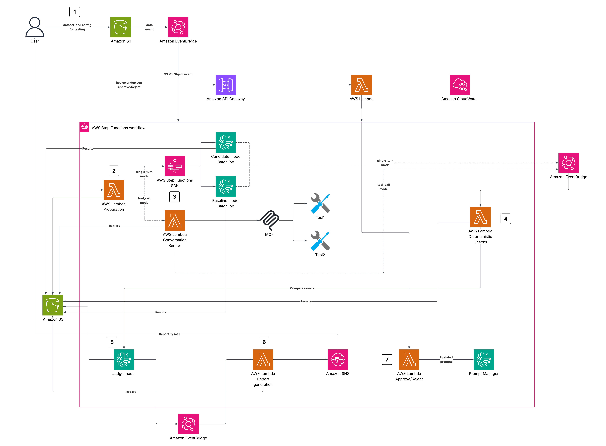

# Automated Regression Testing for Multi-Agent Systems on Amazon Bedrock AgentCore

This repository provides a one-click deployable regression testing pipeline for multi-agent systems running on [Amazon Bedrock AgentCore](https://aws.amazon.com/bedrock/agentcore/). It accompanies the AWS Community blog post [Don't Break Agents During Bedrock Model Upgrades](https://community.aws/).

Deploy the pipeline with Terraform or OpenTofu, upload a configuration file, and the pipeline automatically compares your agents across two model versions — catching regressions before they reach production.

> **This is sample code for demonstration and learning, not a production-ready deployment.** It provisions security-relevant infrastructure (IAM roles, a KMS key, S3 bucket policies, and a VPC). Review and adapt the IAM scoping, encryption, network configuration, and cost controls to your own security and compliance requirements before deploying to a production account. The sample is provided as-is under the MIT-0 License and is not covered by AWS Support.

## What this sample does

When you upgrade the foundation model behind a multi-agent system, an individual agent can quietly regress — worse routing, a dropped tool call, weaker retrieval — even when the final answer still looks acceptable. This sample turns that risk into an automated, repeatable check:

- **Stands up two identical copies** of your agent system from the same container image — one on your current (baseline) model, one on the candidate model.
- **Replays your test cases** against both and captures per-agent OpenTelemetry traces from CloudWatch.
- **Scores on two tiers** — end-to-end output quality (Amazon Bedrock evaluation jobs) *and* per-agent behavior (fast deterministic checks that escalate to an LLM judge only on failure, saving roughly 30–50% of judge cost in the sample workload; see [COST_MODEL.md](docs/COST_MODEL.md) for the assumptions).
- **Produces a comparison report** with per-agent deltas, confidence intervals, and a single PASS/FAIL verdict, then pauses for human approval before promoting the new model to production.

You get a one-command regression gate to run before every model upgrade. It ships with a sample financial-analysis agent swarm that you replace with your own agents and rubrics.

## Architecture



The pipeline orchestrates eight components through AWS Step Functions:

| # | Component | What it does | Key AWS service |
|---|-----------|-------------|-----------------|
| 1 | **Trigger** | Watches S3 `config/` prefix for uploads, starts the state machine | Amazon EventBridge |
| 2 | **Agent Factory** | Creates two AgentCore Runtimes from the same container image — baseline model vs candidate model. Polls until both reach `READY` | Amazon Bedrock AgentCore, AWS Lambda |
| 3 | **Test Case Runner** | Invokes both Runtimes with shared `runtimeSessionId` per test case. Fetches OpenTelemetry spans from CloudWatch `aws/spans`, groups by `agent.name` | Amazon Bedrock AgentCore, Amazon CloudWatch |
| 4 | **Per-Agent Evaluator** | Scores each agent's trace segment. Runs deterministic checks first (free, fast); failures escalate to AgentCore `Evaluate` API for LLM judge scoring | Amazon Bedrock AgentCore |
| 5 | **End-to-End Evaluator** | Calls `CreateEvaluationJob` to batch-score final outputs with built-in metrics: correctness, completeness, faithfulness, helpfulness | Amazon Bedrock |
| 6 | **Report Generator** | Aggregates scores from both tiers into a comparison table with deltas, 95% confidence intervals, and pass/fail verdicts | AWS Lambda |
| 7 | **Approval Gate** | Pauses execution on `.waitForTaskToken`. SNS delivers the report link and approve/reject URLs to reviewers | AWS Step Functions, Amazon SNS |
| 8 | **Promoter** | On approval, calls `UpdateAgentRuntimeEndpoint` to atomically switch the production endpoint to the candidate version. On rejection, archives the run | Amazon Bedrock AgentCore |

### Two-tier evaluation (the core pattern)

```
┌─────────────────────────────────────────────────────────┐
│  Tier 1: End-to-End                                     │
│  Amazon Bedrock CreateEvaluationJob                     │
│  Scores: Correctness, Completeness, Faithfulness,       │
│          Helpfulness                                    │
│  Catches: "The system got worse"                        │
└─────────────────────────────────────────────────────────┘
                         +
┌─────────────────────────────────────────────────────────┐
│  Tier 2: Per-Agent                                      │
│  Deterministic checks → LLM judge escalation            │
│  Scores per role: routing, tool accuracy, RAG           │
│                   faithfulness, synthesis, compliance    │
│  Catches: "THIS agent regressed on THIS dimension"      │
└─────────────────────────────────────────────────────────┘
                         =
        ┌────────────────────────────────┐
        │  Combined signal: PASS/FAIL    │
        │  + root cause isolation        │
        └────────────────────────────────┘
```

### Deterministic checks per agent role

The Per-Agent Evaluator runs role-specific checks before calling the LLM judge. On the sample workload this saves roughly 30–50% of judge costs, based on the escalation rate and per-tier pricing documented in [COST_MODEL.md](docs/COST_MODEL.md):

| Agent Role | Check | What it verifies |
|-----------|-------|-----------------|
| **Supervisor** | Routing correctness | Expected specialists were invoked |
| **Data Retrieval** | Tool call accuracy | Correct tool called with correct parameters |
| **Research** | RAG faithfulness | Correct knowledge base queried |
| **Analysis** | Synthesis quality | Sufficient output tokens (depth proxy) |
| **Compliance** | Policy adherence | Guardrail fired when expected, silent otherwise |

Only when a deterministic check **fails** does the evaluator escalate to AgentCore's `Evaluate` API with the agent's trace and a reference answer. The LLM judge returns a score, label, and explanation.

### Data flow

```
S3 config/ upload
    → EventBridge rule
        → Step Functions
            → Agent Factory (create baseline + candidate Runtimes)
            → Test Case Runner (invoke both, capture spans)
            → [Parallel]
                → Per-Agent Evaluator → scores/per-agent/
                → E2E Evaluator → scores/e2e/
            → Report Generator → results/{run_id}/report.json
            → Choice: FAIL → Archive | PASS → Approval Gate
            → Promoter → UpdateAgentRuntimeEndpoint
```

## Prerequisites

- AWS account with Amazon Bedrock model access
- Model access enabled for three models of your choice (baseline, candidate, and judge). Defaults:
  - Baseline: `anthropic.claude-sonnet-4-5`
  - Candidate: `anthropic.claude-sonnet-4-6`
  - Judge: `anthropic.claude-opus-4-6`
  
  You can use any models available in your region — configure via `baseline_model`, `candidate_model`, and `judge_model` in `terraform.tfvars`.
- [Terraform](https://www.terraform.io/downloads) >= 1.5 or [OpenTofu](https://opentofu.org/docs/intro/install/) >= 1.6
- AWS CLI v2 configured with credentials
- Docker (for building the agent container image)
- Python 3.13 (for running tests)
- CloudWatch Transaction Search enabled (CloudWatch console → **Application Signals** → **Settings**)

## Installation

### Step 1: Clone and run setup

```bash
git clone https://github.com/alexkro-code/blog3-agentcore-model-upgrade.git
cd blog3-agentcore-model-upgrade

bash setup.sh
```

The interactive setup asks for:

1. **AWS account** — confirms your current CLI identity and account ID
2. **Region** — deployment region (default: `us-east-1`)
3. **VPC** — no VPC, create a new VPC (with CIDR selection), or use an existing VPC (lists available VPCs)
4. **Resource tag** — mandatory tag for cost tracking (default: `CostCenter = bedrock-regression-testing`)
5. **Pipeline settings** — production Runtime ARN, Runtime IAM role, approval email

The script generates `infra/terraform.tfvars`. You can also edit this file manually — see `infra/terraform.tfvars.example` for all options.

### Step 2: Deploy infrastructure

```bash
cd infra
terraform init
terraform apply
```

This creates: S3 bucket, 6 Lambda functions, Step Functions state machine, EventBridge rule, SNS topic, ECR repository, IAM roles (least-privilege per function), CloudWatch log groups, and optionally VPC resources.

For OpenTofu: replace `terraform` with `tofu`.

### Step 3: Build and push the agent container

```bash
cd ../app
bash build_and_push.sh
```

This builds the multi-agent Docker image and pushes it to the ECR repository created in Step 2. The default image uses the sample financial analysis swarm (`supervisor.py`). Replace with your own agents.

### Step 4: Upload datasets and trigger

```bash
cd ..
BUCKET=$(cd infra && terraform output -raw bucket_name)

# Upload test cases
aws s3 cp datasets/e2e-cases.jsonl "s3://$BUCKET/datasets/e2e-cases.jsonl"
aws s3 cp datasets/per-agent-cases.jsonl "s3://$BUCKET/datasets/per-agent-cases.jsonl"

# Trigger the pipeline (config upload starts the state machine)
aws s3 cp configs/sample-config.json "s3://$BUCKET/config/regression-config.json"
```

### Step 5: Monitor and approve

Check the Step Functions console for the running execution. When it reaches the approval gate, check your email for the SNS notification with the report link. Review the results and approve or reject.

## Configuration Reference

Edit `infra/terraform.tfvars` (or re-run `bash setup.sh`):

| Variable | Description | Default |
|----------|-------------|---------|
| `aws_region` | Deployment region | `us-east-1` |
| `project_name` | Resource name prefix | `agent-regression` |
| `production_runtime_arn` | Your production Runtime ARN | (required) |
| `runtime_role_arn` | Runtime execution IAM role | (required) |
| `approval_email` | SNS notification recipient | (required) |
| `baseline_model` | Model ID for baseline (any Bedrock model) | `anthropic.claude-sonnet-4-5` |
| `candidate_model` | Model ID for candidate (any Bedrock model) | `anthropic.claude-sonnet-4-6` |
| `judge_model` | Model ID for LLM judge (any Bedrock model) | `anthropic.claude-opus-4-6` |
| `e2e_threshold` | Minimum E2E correctness | `0.85` |
| `per_agent_floor` | Minimum per-agent score | `0.80` |
| `max_regression_delta` | Max tolerated regression | `0.10` |
| `runs_per_config` | Repetitions for confidence | `3` |
| `log_retention_days` | CloudWatch log retention | `365` |
| `reserved_concurrency` | Reserved concurrent executions per Lambda | `5` |
| `vpc_enabled` | Deploy Lambdas inside a VPC | `false` |
| `create_vpc` | Create a new VPC (vs. use existing) | `false` |
| `vpc_cidr` | CIDR for new VPC | `10.0.0.0/16` |
| `existing_vpc_id` | VPC ID when using existing VPC | `""` |
| `existing_subnet_ids` | Subnet IDs in existing VPC | `[]` |
| `image_uri` | ECR image URI (set by `build_and_push.sh`) | `""` (auto) |
| `production_endpoint_name` | Name of the production endpoint | `"production"` |
| `tags` | Tags applied to all resources | `Project`, `ManagedBy` |

## Monitoring the Pipeline

### What to watch during execution

| Phase | Where to look | What indicates success |
|-------|--------------|----------------------|
| Trigger | EventBridge → Rules → `agent-regression-trigger` | Rule invocation count > 0 |
| Agent Factory | Step Functions console → execution graph | Both Runtimes reach `READY` within 5 minutes |
| Test Runner | CloudWatch Logs → `/aws/lambda/agent-regression-test-runner` | All test cases produce output and spans |
| Per-Agent Evaluator | S3 → `results/{run_id}/per-agent-scores.json` | Score file written with all agent roles |
| E2E Evaluator | Bedrock console → Model evaluation jobs | Job status `Completed` (allow up to 60 min) |
| Report Generator | S3 → `results/{run_id}/report.json` | Report written with `overall_verdict` |
| Approval Gate | Email inbox / SNS subscription | Notification received with report link |
| Promoter | AgentCore console → Runtime endpoints | Endpoint version updated to candidate |

### CloudWatch metrics to monitor

Set up alarms for ongoing pipeline health:

| Metric | Namespace | Alarm condition | Indicates |
|--------|-----------|----------------|-----------|
| `Errors` per Lambda | AWS/Lambda | > 0 for any function | Pipeline stage failure |
| `ExecutionsFailed` | AWS/States | > 0 | State machine error |
| `Duration` for Test Runner | AWS/Lambda | > 800000 ms | Timeout risk (max 900s) |
| `NumberOfMessagesPublished` | AWS/SNS | = 0 after report generation | Approval notification failed |
| `InvokeAgentRuntime` latency | Custom (emit from Test Runner) | > 30s per invocation | Runtime performance issue |

### Log groups to inspect on failure

| Log group | When to check |
|-----------|--------------|
| `/aws/lambda/agent-regression-agent-factory` | Runtime creation fails or stays `CREATING` |
| `/aws/lambda/agent-regression-test-runner` | Spans missing or invocation errors |
| `/aws/lambda/agent-regression-per-agent-evaluator` | Scoring anomalies or `Evaluate` API errors |
| `/aws/lambda/agent-regression-e2e-evaluator` | `CreateEvaluationJob` fails |
| `/aws/states/agent-regression-pipeline` | State transitions or JSONata expression errors |
| `/aws/bedrock-agentcore/runtimes/{runtime_id}` | Container startup or OOM errors |

### Interpreting the report

The report at `results/{run_id}/report.json` contains:

```json
{
  "overall_verdict": "PASS|FAIL",
  "per_agent_summary": {
    "supervisor": {"baseline": {"mean": 1.0}, "candidate": {"mean": 1.0}, "delta": 0.0, "verdict": "PASS"},
    "research":   {"baseline": {"mean": 0.92}, "candidate": {"mean": 0.90}, "delta": -0.02, "verdict": "PASS"}
  },
  "thresholds": {"e2e_correctness": 0.85, "per_agent_floor": 0.80, "max_regression_delta": 0.10}
}
```

A `FAIL` verdict means either:
- An agent's score dropped below `per_agent_floor` (absolute failure)
- The delta between baseline and candidate exceeds `max_regression_delta` (relative regression)

## Project Structure

```
├── setup.sh                        # Interactive setup (generates terraform.tfvars)
├── infra/                          # Terraform/OpenTofu infrastructure
│   ├── main.tf                         # Provider, data sources
│   ├── variables.tf                    # All configurable inputs
│   ├── outputs.tf                      # Bucket name, state machine ARN, etc.
│   ├── versions.tf                     # Provider version constraints
│   ├── kms.tf                          # Customer-managed key (S3/Logs/ECR/SNS/Lambda env)
│   ├── s3.tf                           # Pipeline + access-log buckets (CMK, lifecycle)
│   ├── lambda.tf                       # 6 Lambda functions
│   ├── iam.tf                          # Least-privilege roles
│   ├── vpc.tf                          # Optional VPC, subnets, endpoints
│   ├── stepfunctions.tf                # State machine
│   ├── eventbridge.tf                  # S3 trigger rule
│   ├── sns.tf                          # Approval notifications
│   ├── ecr.tf                          # Container registry
│   ├── cloudwatch.tf                   # Log groups
│   └── terraform.tfvars.example        # Template for your values
├── app/                            # Multi-agent system
│   ├── supervisor.py                   # Strands Agents + AgentCore Runtime
│   ├── Dockerfile                      # Container with OTel instrumentation
│   ├── requirements.txt
│   └── build_and_push.sh              # ECR build/push script
├── functions/                      # Pipeline Lambda handlers
│   ├── agent_factory/handler.py        # CreateAgentRuntime x2, poll READY
│   ├── test_runner/handler.py          # InvokeAgentRuntime, fetch/parse spans
│   ├── per_agent_evaluator/            # Deterministic checks + LLM judge
│   │   ├── handler.py
│   │   └── rubrics.py                  # Per-role scoring criteria
│   ├── e2e_evaluator/handler.py        # CreateEvaluationJob wrapper
│   ├── report_generator/handler.py     # Aggregate scores, compute verdicts
│   └── promoter/handler.py             # UpdateAgentRuntimeEndpoint
├── statemachine/
│   └── regression_pipeline.asl.json    # Full 10-state Step Functions ASL
├── datasets/                       # Sample test cases
│   ├── e2e-cases.jsonl                 # 10 end-to-end cases
│   └── per-agent-cases.jsonl           # 10 per-agent golden cases
├── configs/
│   └── sample-config.json             # Pipeline trigger configuration
├── tests/
│   ├── unit/                          # Offline tests (no AWS needed)
│   └── integration/                   # Post-deploy smoke tests
└── docs/
    ├── COST_MODEL.md                  # Detailed cost breakdown
    └── EXTENDING.md                   # Add agents, modify rubrics
```

## Running Tests

```bash
# Unit tests — no AWS credentials needed
pip install pytest==9.1.1
python -m pytest tests/unit/ -v

# Integration tests — requires deployed infrastructure
python -m pytest tests/integration/ -v --run-integration
```

## Customizing for Your Agents

1. Replace `app/supervisor.py` with your multi-agent system
2. Update `functions/per_agent_evaluator/rubrics.py` with your role-specific scoring criteria
3. Update `DETERMINISTIC_CHECKS` in `functions/per_agent_evaluator/handler.py` for your agent roles
4. Create test datasets in `datasets/` following the JSONL schemas (see existing files as templates)

See [docs/EXTENDING.md](docs/EXTENDING.md) for detailed guidance on adding roles, changing frameworks, and customizing metrics.

## Cost Estimate

A typical run with 4 subagents, 10 E2E cases, 10 per-agent cases, and 3 repetitions costs approximately $50-100. Costs scale linearly with dataset size. See [docs/COST_MODEL.md](docs/COST_MODEL.md) for a detailed breakdown and optimization strategies.

## Clean Up

Remove all pipeline resources:

```bash
cd infra
terraform destroy
```

This deletes: Lambda functions, Step Functions state machine, EventBridge rules, SNS topic, ECR repository (and images), IAM roles, CloudWatch log groups, and the S3 bucket.

Your production Runtime and endpoint are **not affected** — they are referenced by ARN, not managed by this stack.

To keep the S3 bucket data (traces, reports) before destroying:

```bash
BUCKET=$(terraform output -raw bucket_name)
aws s3 sync "s3://$BUCKET" ./backup-data/
```

## Security

- All Lambda functions use least-privilege IAM roles scoped to their specific actions
- A customer-managed KMS key (`kms.tf`, rotation enabled) encrypts the S3 bucket,
  Lambda environment variables, CloudWatch log groups, ECR images, and the SNS topic
- The S3 bucket blocks all public access and writes server access logs to a dedicated log bucket
- X-Ray tracing is enabled on the Lambda functions and the Step Functions state machine
- API keys and credentials belong in AWS Secrets Manager (not environment variables)
- Container images are scanned on push via ECR image scanning and run as a non-root user
- The pipeline does not store or log model responses beyond S3 (encrypted at rest)

See [CONTRIBUTING](CONTRIBUTING.md#security-issue-notifications) for reporting security issues.

## Responsible AI

This sample evaluates AI systems, so it applies the same responsible-AI practices it helps you enforce:

- **Human oversight.** The pipeline never promotes a model version on its own. The Step Functions workflow pauses at an `AwaitApproval` step (`sns:publish.waitForTaskToken`) and waits for a human to approve or reject before the candidate model reaches production.
- **Guardrails.** The per-agent evaluator tracks Amazon Bedrock Guardrails interventions from the agent traces (`guardrail.intervene` events) and scores whether the compliance agent behaved as expected, so a model change that weakens guardrail behavior is caught as a regression.
- **Synthetic data only.** The bundled datasets use fictitious entities (the AWS "AnyCompany" placeholder) and invented figures — no real customer data, PII, or confidential information. Replace them with your own representative-but-sanitized cases.
- **Model-neutral scoring.** Rubrics score behavior (routing, tool accuracy, faithfulness, synthesis, compliance), not a specific model's phrasing, so the same evaluation applies fairly across model versions.
- **Transparency.** Every run produces a comparison report with per-agent deltas and confidence intervals ([COST_MODEL.md](docs/COST_MODEL.md) documents the cost assumptions), so reviewers can see *why* a verdict was reached before approving a promotion.

When you adapt this sample to your own agents, extend these practices to your domain — for example, add fairness or bias checks relevant to your use case as additional deterministic rubrics.

## License

This library is licensed under the MIT-0 License. See the [LICENSE](LICENSE) file.
